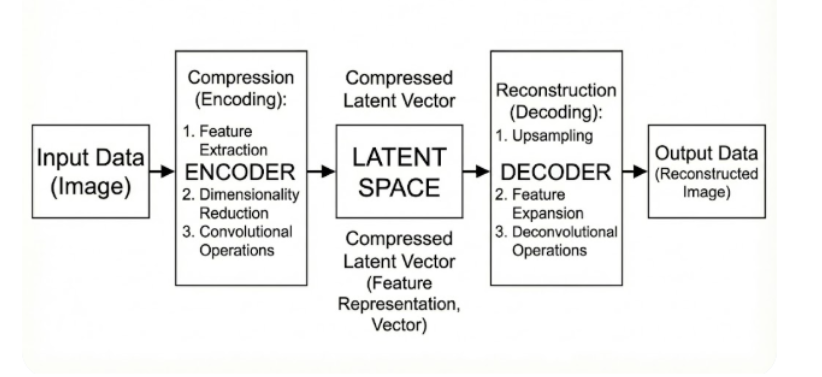

# Using Auto-Encoder To Extracting Or Suppress GAN Model Fingerprints
Our work here is to train an autoencoder to  extract or suppress model fingerprints from synthetic images.
In our Presentation Attack Detection(PAD) system, we were able to confirm the presence of artifacts in GAN generated finger-vein images.
This negatively affected our classifier trained on the fourier features (energy bands), as the real image data were progressively replaced and augumented with synthetic data.
The classifier responded more to the embedded artifacts in the frequency domain than the structural similarities of these synthetic images to the real ones.
This was problematic because even though the classifier could distinguish real and synthetic samples, it failed to discriminate bonafide and spoofed samples.
Earlier we had tried to remove these artifacts using spatial filtering technigues by treating these model fingerprints as Photo Response Non-Uniformity(PRNU) pattern noise. But this has not been very helpful. It is observed these filters only captured the high frequency noise and ignored the low frequency components, such that suppression was minimal and not enough to effectively fool the classifier during detection.

# Encoder Structure 

The design of the encoder structure leverages on the Xception network's structure for its feature extraction capabilites to train a model only on real finger vein images. Like the Neves et al hypothesizes, these fingerprints can be removed by this autoencoder, which acts as a non-linear low-pass filter.

# Input And Resulting Output From The Encoder Structure

